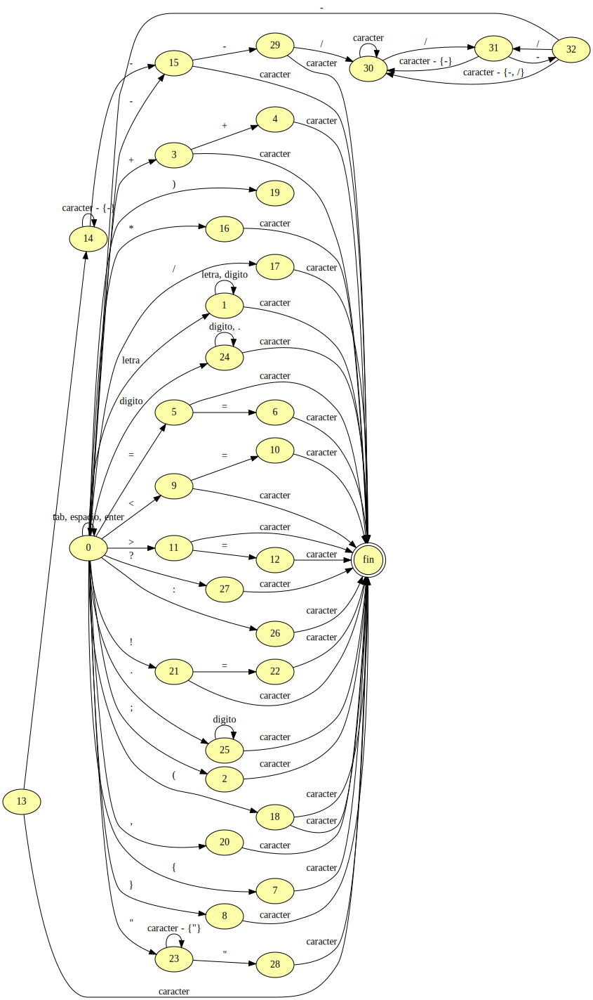

# lyc
TP Lenguajes y compiladores UNLaM 

# Organizacion de archivos
## Carpeta bin
Binario generados durante el make
## Carpeta lex
Codigo fuente del analizador lexico

## Carpeta test
Archivos necesarios para hacer los test de todo el proyecto

