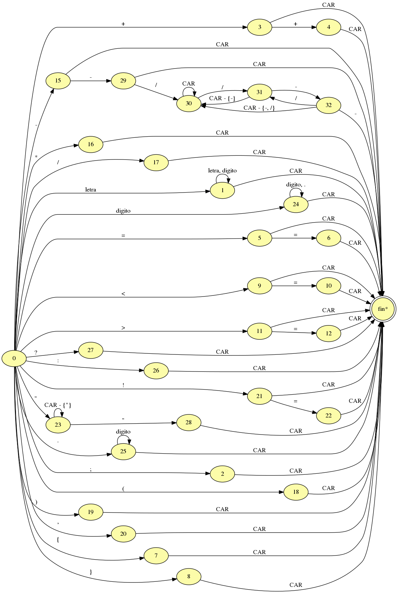

# lyc
TP Lenguajes y compiladores UNLaM 

# Organizacion de archivos
## Carpeta doc
Documentacion del proyecto.

Tip: Para generar el automata finito a partir del archivo [automata.gv](doc/automata.gv) se necesita el programa graphviz
## Carpeta lex
Codigo fuente del analizador lexico

## Carpeta test
Archivos necesarios para hacer los test de todo el proyecto

